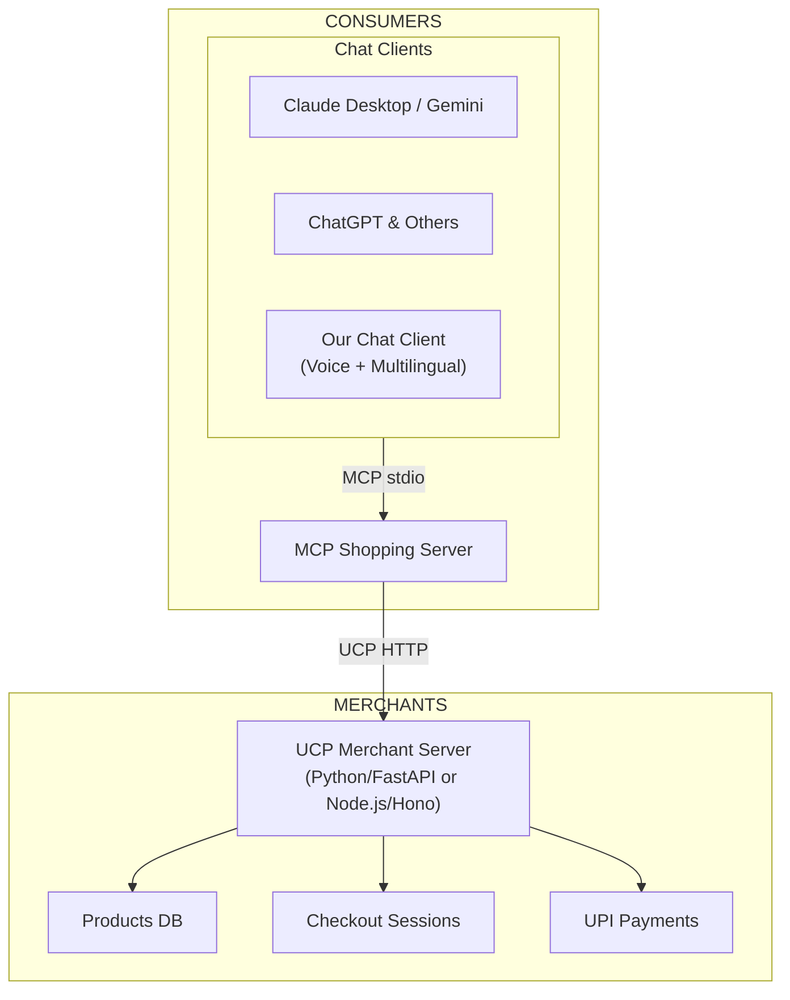

# Agentic Commerce

An India-first agentic commerce stack — discover, decide, and transact through AI.

Built on Google's [Universal Commerce Protocol (UCP)](https://developers.google.com/merchant/ucp/guides), with UPI payments and multilingual interactions in 11+ Indian languages.

## The Opportunity

India has all the primitives for agentic commerce — the rise of AI-first users, the explosion of D2C brands, ubiquitous UPI, and hundreds of millions of vernacular users. What's missing is the **glue** that turns these into an end-to-end experience for both merchants and consumers.

**For Merchants:** AI chat interfaces (Claude, ChatGPT, Gemini) are the next frontier of shopping. But becoming [UCP-compliant](https://developers.googleblog.com/under-the-hood-universal-commerce-protocol-ucp/) and setting up the required infra is hard. Merchants need a way to get visibility to millions of users without the complexity.

**For Consumers:** Users are already searching for products and recommendations on AI apps. The next step is completing the entire checkout — discovery to payment — without leaving the chat. And in India, that experience must be voice-first and multilingual.

## How It Works

### For Merchants — Go Live in Seconds

Provide your **product catalogue** and **UPI VPA**. That's it.

We handle the rest — generating a fully UCP-compliant merchant server, discovery profile, inventory, shipping rates, and payment integration. Your products become instantly visible to any AI agent or chat client that speaks UCP.

```
Catalogue CSV + UPI VPA → UCP-Compliant Merchant Server → Visible on Claude, ChatGPT, Gemini, and more
```

**What gets generated:**
- UCP discovery profile (`/.well-known/ucp`)
- Product database with search and categories
- Checkout session management
- UPI payment link and QR code generation
- Order lifecycle tracking
- Shipping rate configuration (domestic + international)

Use the **merchant onboarding web app** for a guided experience, or the CLI for automation.

### For Consumers — Shop From Any AI Chat

#### Option 1: MCP Server (Any Chat Client)

Add our [MCP](https://modelcontextprotocol.io) shopping server to **Claude Desktop, Gemini, ChatGPT**, or any MCP-compatible client. The full shopping flow works inside your existing chat:

1. **Discover** — Find merchants and browse products
2. **Decide** — Search, compare, get AI recommendations
3. **Cart** — Add, update, remove items
4. **Pay** — Generate a UPI payment link / QR code, pay with any UPI app
5. **Confirm** — Complete the order, all without leaving the chat

#### Option 2: Our Chat Client (Enhanced Experience)

For a richer experience, use our built-in chat client:

- **11+ Indian languages** — Shop in Hindi, Tamil, Telugu, Bengali, Marathi, Kannada, Malayalam, Gujarati, Odia, Punjabi, and more
- **Voice-first** — Speak in your language, get responses in your language
- **Rich UX** — Product cards, cart views, QR codes, artifacts, and more
- **Powered by Claude** with full MCP tool integration

## Architecture



## Project Structure

| Component | Path | Description |
|---|---|---|
| **MCP Shopping Server** | [`mcp_client.py`](mcp_client.py) | MCP server exposing shopping tools for any AI chat client |
| **Merchant Onboarding CLI** | [`onboard_merchant.py`](onboard_merchant.py) | Transforms a catalogue CSV into a full UCP-ready deployment |
| **UPI Payments** | [`payment.py`](payment.py) | UPI deep link and QR code generation |
| **UCP Server (Python)** | [`rest/python/server/`](rest/python/server/) | UCP merchant server — FastAPI + SQLite |
| **UCP Server (Node.js)** | [`rest/nodejs/`](rest/nodejs/) | UCP merchant server — Hono + better-sqlite3 |
| **Chat Client** | [`chat/`](chat/) | Next.js AI chat with MCP integration, multilingual support |
| **Onboarding Web App** | [`web/`](web/) | React + FastAPI merchant onboarding UI ("Saarthi") |
| **Multilingual / Voice** | [`sarvam/`](sarvam/) | Sarvam AI integration — ASR, TTS, translation, language detection |
| **Demo Data** | [`demo_data/`](demo_data/) | Sample Indian artisan catalogue (textiles, pottery, spices, jewelry) |

## Quick Start

### Prerequisites

- Python ≥ 3.10 with [uv](https://docs.astral.sh/uv/)
- Node.js ≥ 18 with pnpm
- A UPI VPA for receiving payments

### 1. Onboard a Merchant

Using the demo catalogue:

```bash
uv run onboard_merchant.py \
  --catalogue demo_data/catalogue.csv \
  --merchant-name "Artisan India" \
  --upi-vpa "merchant@upi" \
  --output-dir deploy/artisan-india
```

Or use the web UI:

```bash
# Backend
cd web/backend && uv run --project ../.. uvicorn main:app --reload --port 8080

# Frontend (in another terminal)
cd web/frontend && npm install && npm run dev
```

Open http://localhost:5173, enter your merchant details, upload your catalogue, and you're live.

### 2. Start the UCP Merchant Server

**Python:**

```bash
cd rest/python/server && uv sync

# Import data
uv run import_csv.py \
  --products_db_path=../../deploy/artisan-india/data/products.db \
  --transactions_db_path=../../deploy/artisan-india/data/transactions.db \
  --data_dir=../../deploy/artisan-india/data

# Start server
uv run server.py \
  --products_db_path=../../deploy/artisan-india/data/products.db \
  --transactions_db_path=../../deploy/artisan-india/data/transactions.db \
  --discovery_profile_path=../../deploy/artisan-india/discovery_profile.json \
  --port=8000
```

**Node.js:**

```bash
cd rest/nodejs && npm install && npm run dev  # port 3000
```

### 3. Connect to a Chat Client

**Claude Desktop** — Add to your Claude Desktop config (`claude_desktop_config.json`):

```json
{
  "mcpServers": {
    "shopping": {
      "command": "uv",
      "args": ["run", "python", "mcp_client.py"],
      "cwd": "/path/to/agentic-commerce",
      "env": {
        "MERCHANT_URL": "http://localhost:8000",
        "MERCHANT_VPA": "merchant@upi",
        "MERCHANT_NAME": "Artisan India"
      }
    }
  }
}
```

**Our Chat Client** (with voice + multilingual support):

```bash
cd chat && pnpm install && pnpm db:migrate && pnpm dev
```

Open http://localhost:4000 and start shopping in your language.

## MCP Tools

The MCP server exposes these tools to any connected AI agent:

| Tool | Description |
|---|---|
| `discover_merchant` | Connect to a UCP merchant via `/.well-known/ucp` |
| `browse_categories` | List all product categories |
| `search_products` | Search by keyword and/or category |
| `get_product` | Get full product details |
| `add_to_cart` | Add a product to the cart |
| `view_cart` | View current cart contents |
| `update_cart` | Update item quantity |
| `remove_from_cart` | Remove an item |
| `checkout` | Create checkout session, generate UPI payment link + QR |
| `confirm_payment` | Confirm payment with UTR and complete the order |

## UCP Compliance

Fully compliant with the [UCP specification](https://developers.google.com/merchant/ucp/guides):

- **Protocol version:** `2026-01-11`
- **Discovery:** `/.well-known/ucp` endpoint
- **Capabilities:** checkout, order, discount, fulfillment, buyer consent
- **Payment:** UPI (`in.npci.upi`)
- **Headers:** `UCP-Agent`, `Request-Signature`, `Idempotency-Key`, `Request-Id`
- **Conformance:** Compatible with the official UCP conformance test suite

## Environment Variables

| Variable | Component | Description |
|---|---|---|
| `MERCHANT_URL` | MCP Server | UCP merchant server URL |
| `MERCHANT_VPA` | MCP Server | Merchant UPI VPA |
| `MERCHANT_NAME` | MCP Server | Merchant display name |
| `MCP_MERCHANT_URL` | Chat Client | Merchant URL for MCP connection |
| `MCP_MERCHANT_VPA` | Chat Client | Merchant VPA |
| `MCP_MERCHANT_NAME` | Chat Client | Merchant name |
| `MCP_UV_PATH` | Chat Client | Path to `uv` binary |
| `AUTH_SECRET` | Chat Client | Auth.js secret |
| `SARVAM_API_KEY` | Voice/Translation | Sarvam AI API key |

## Catalogue Format

Your product catalogue CSV needs these columns:

| Column | Required | Description |
|---|---|---|
| `id` | Yes | Unique product identifier |
| `title` | Yes | Product name |
| `price` | Yes | Price in paise (e.g., 250000 = ₹2,500) |
| `image_url` | Yes | Product image URL |
| `description` | No | Product description |
| `category` | No | Product category |
| `origin_state` | No | State of origin |
| `artisan_name` | No | Artisan / maker name |
| `inventory_quantity` | No | Stock count (default: 100) |

## License

Apache 2.0 — see [LICENSE](LICENSE) for details.
